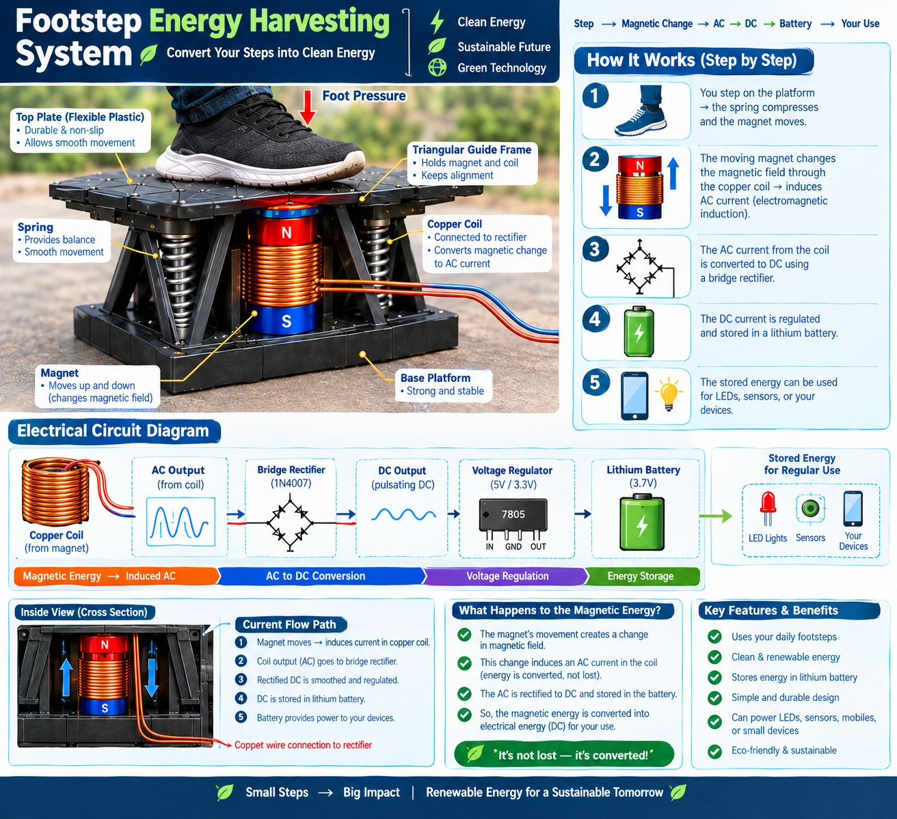

# Footstep-Based Energy Harvesting and Storage System

A prototype concept for converting mechanical energy from human footsteps into electrical energy using controlled platform movement, springs, magnets, and copper coils.



## Project overview

When a person steps on the flexible top platform, the platform moves against a spring mechanism. This produces relative movement in the magnetic generation mechanism and changes the magnetic flux associated with the copper winding. According to Faraday's law of electromagnetic induction, this changing flux induces an electrical output.

The generated output is intended to pass through a bridge rectifier, filter, voltage/charge-control circuit, and rechargeable battery before powering suitable low-power loads such as LEDs, sensors, displays, or IoT devices.

```text
Footstep
   ↓
Flexible top platform
   ↓
Spring-based motion
   ↓
Magnet movement relative to copper coil
   ↓
AC electrical output
   ↓
Bridge rectifier and filter
   ↓
Voltage / charge control
   ↓
Rechargeable battery
   ↓
Low-power electrical load
```

## Documentation

- [Complete project proposal](docs/project-proposal.md)

## Important engineering and safety notes

- The design must provide meaningful relative magnetic-flux change through the coil; moving the magnet and coil together will not automatically generate useful energy.
- A lithium battery must **not** be connected directly to an unknown or raw generator output. Use a suitable battery-management and charging circuit for the selected battery chemistry and voltage.
- Final platform travel, spring compression, magnet spacing, structural strength, and electrical output must be validated experimentally.
- Do not report invented voltage, current, power, or energy values. Record measurements after testing.

## Potential applications

The concept is intended for investigation in high-footfall locations such as schools, colleges, offices, shopping centers, railway stations, exhibition centers, and other public buildings. Expected applications are limited to low-power electronics unless testing demonstrates otherwise.

## Status

Concept and prototype-development proposal. Experimental measurements and validated hardware results are to be added after testing.
